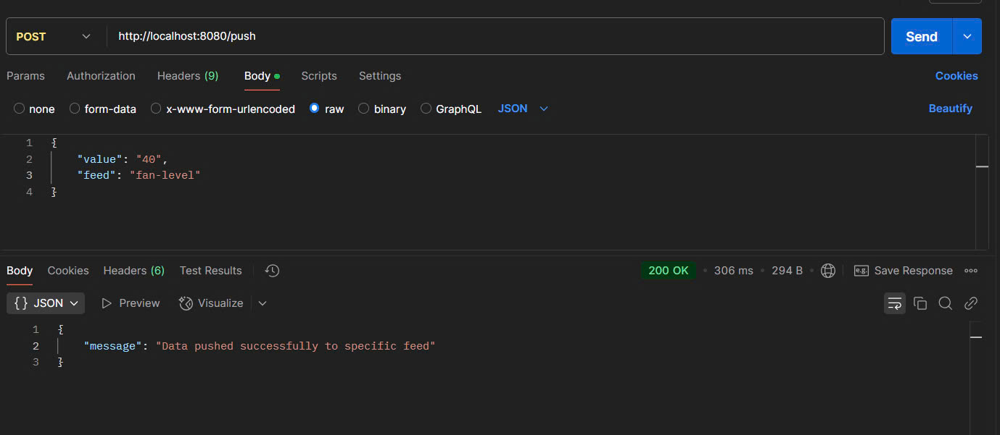

Create a file named app.env with the following content:
```bash
USERNAME1=anhcevn  
AIOKEY=aio_zlGc66xi5KSqUbBHPU8HR8mg6wGv 
FEEDKEYGET=bbc-hum,pir-sensor,iot-project
FEEDKEYPOST=fan-level,relay-sensor
```

Once done correctly, your screen should resemble the following:




